# Project 2 #

The country I chose is Tajikstan.

## Model 1 ##

### Using the R script provided, split and sample your DHS persons data and evaluate the AUC - ROC values you produce. Which "top_model" performed the best (had the largest AUC)? ###
Below is the chart containing the information of the best 15 models: 

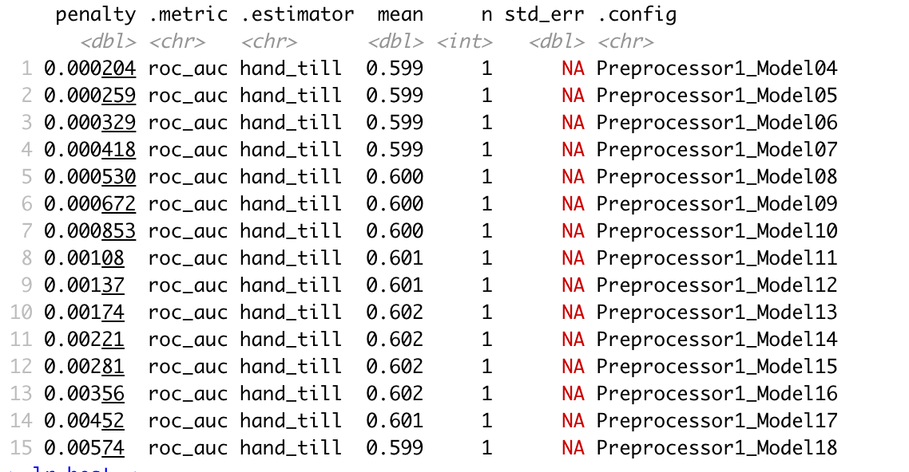

According to AUC graphs, slice 1-15 performed relatively similarly and have essentially identical AUC graphs. Below is a few randomly selected examples.

Slice 7:
  
Slice 10:
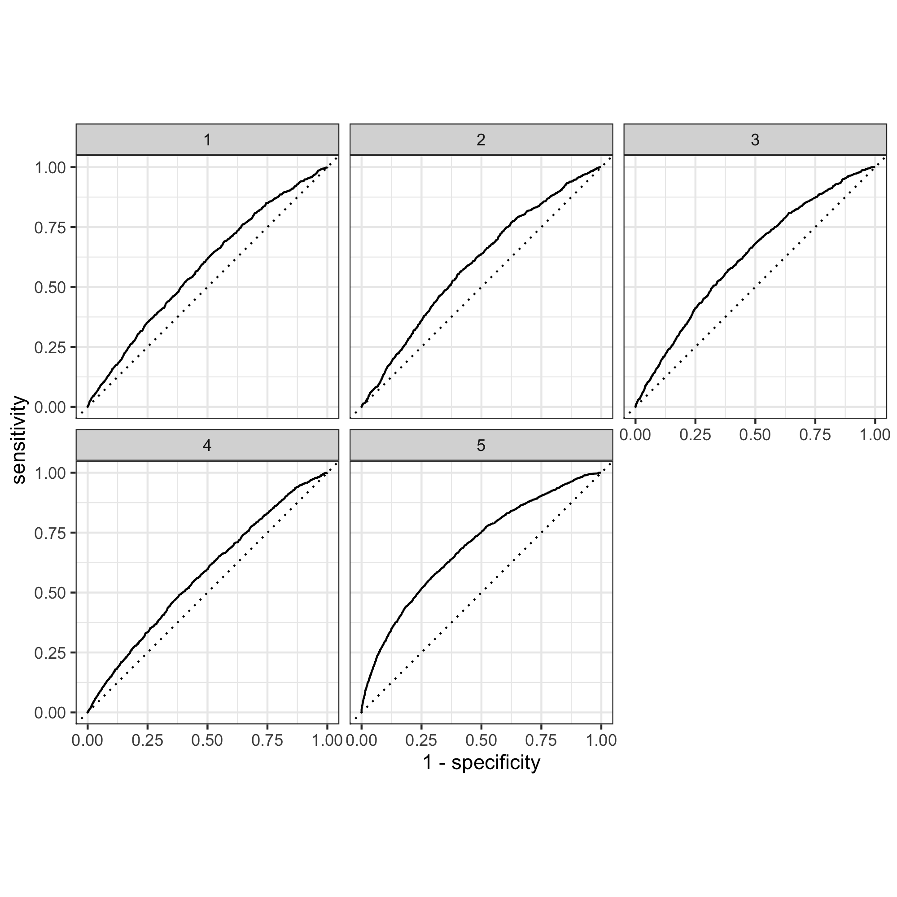 
Slice 15:
 

While slice 1-15 look familiar, models after 15 start to perform worse. Below is slice 19:
 
And when I reached slice 26, it is obvious that this is not an accurate model, especially as shown in graph 1: 
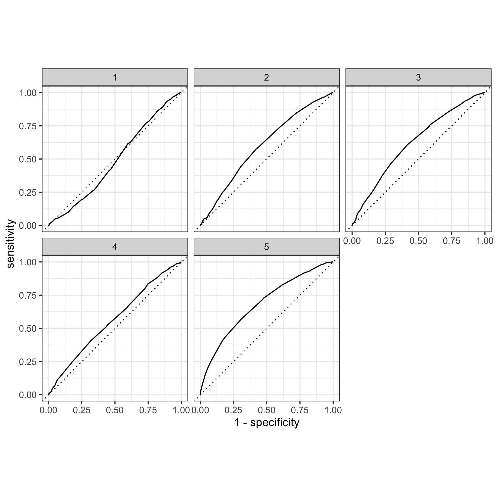 

### Are you able to use the feature selection penalty to tune your hyperparameter and remove any potentially irrelevant predictors? 

I think so, as the penalty values in models from 1-15 indeed provided larger AUC compared to the ones in the subsequent models. However, since model 1-15 differed very slightly in their AUC, it is hard to say which model is the best. 

### Provide justification for your selected penalty value? ###

I chose model 10 because it has the largest mean value (0.602). Among the four models (model 10, 11, 12, 13) that have a mean value of 0.602, model 10 has the smallest penalty value (0.00174). 

### How effective is your penalized logistic regression model at predicting each of the five wealth outcomes. ###
(ROC plots have been shown above) 

Here is the five wealth outcomes predicted by model 10:
 
The model seems to be able to differentiate 1, 4, and 5 from each other and from 2 and 3, but the model could not differentiate between 2 and 3 very well because these two graphs looked very similar. This may be because 2 and 3 represent the middle-income families with relatively similar wealth status and therefore the model couldn't distinguish between them. Overall, 1-4 did not perform well because the area under the curve is not large for all of these graphs. This may be that since Tajikstan is a authoritarian dictatorship and a low-income economy, the majority of the people are low income (even the "middle class") compared to developing and developed nations. Therefore it was hard for the model to distinguish among wealth group 1-4. In comparison, the model distinguished the fifth wealth group, which represents the wealthiest class in the nation. 

## Model 2 ##
### Using the R script provided, set up your random forest model and produce the AUC - ROC values for the randomly selected predictors
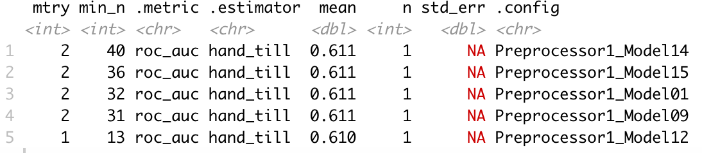 
### and the minimal node size, again with wealth as the target. ### 
Below is a graph of the minimal node size:
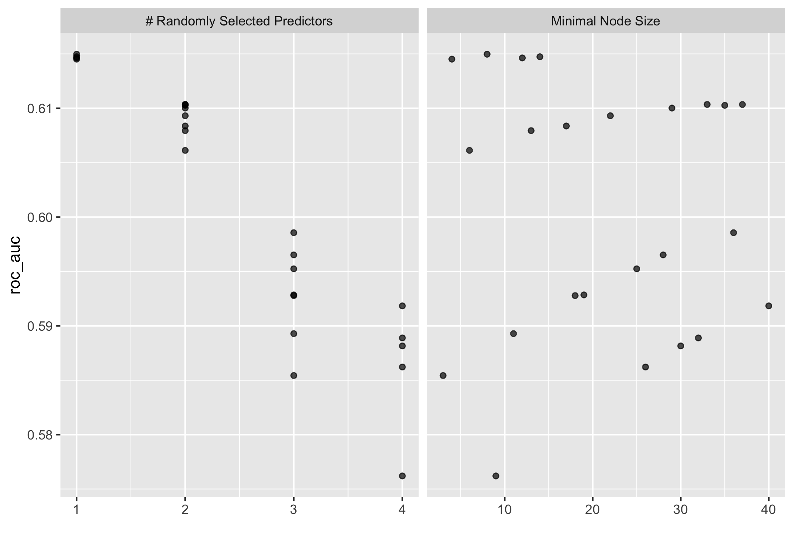 
### How did your random forest model fare when compared to the penalized logistic regression? Provide your ROC plots and interpret them. ###
ROC plot for random forest model:

Judging from the plot, the AUC of the random forest model looks very similar compared to the penalized logistic regression model. However, the random forest performed slightly better in wealth group 1 than the penalized LR did. In wealth group 2, 3, 4, and 5 the two models performed similarly. Judging from the mean values, the penalized LR slice 10 has a mean value of 0.601, while the RF model has a slightly bigger value of 0.611.

### Are you able to provide a plot that supports the relative importance of each feature's contribution towards the predictive power of your random forest ensemble model? ###
As seen on this graph, the results of the two models are highly similar:
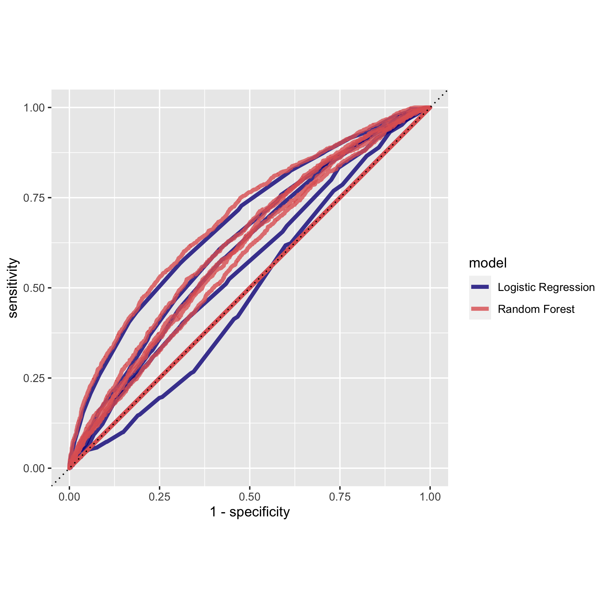

## Model 3 ##
### Using the python script provided, train a logistic regression model using the tensorflow estimator API and your DHS data, again with wealth as the target. Apply the linear classifier to the feature columns and determine the accuracy, AUC and other evaluative metrics towards each of the different wealth outcomes. ###

### Then continue with your linear classifier adding the derived feature columns you have selected in order to extend capturing combinations of correlations (instead of learning on single model weights for each outcome). Again produce your ROC curves and interpret the results. ###

The evaluation for the linear model:

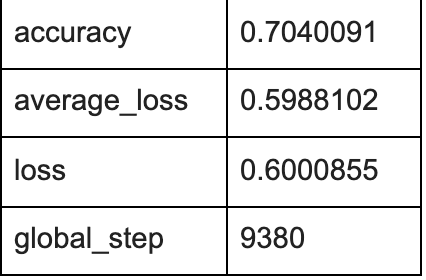

The plots below show that the model performed better than a random model. The histogram showed a bimodal-looking distribution skewed somewhat to the right. The model might have underpredicted values as the model is skewed to the right. The ROC plot has an increasing pattern, which means that the logistic regression model performed better than a random one.

ROC curve:
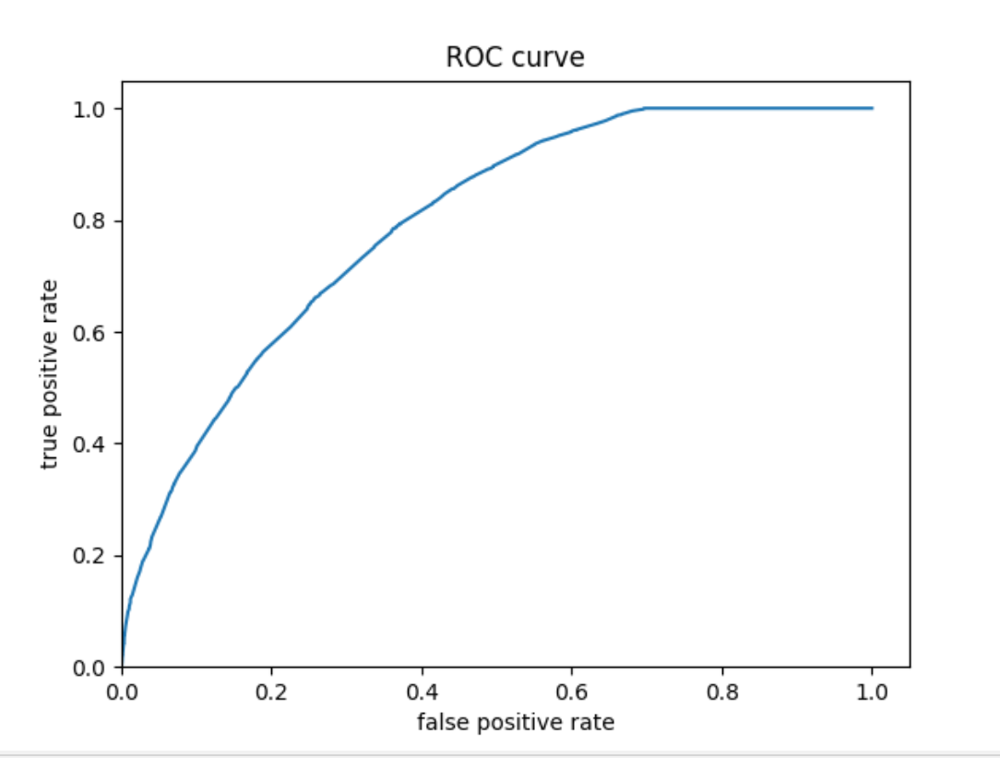
Predicted probabilities histogram:
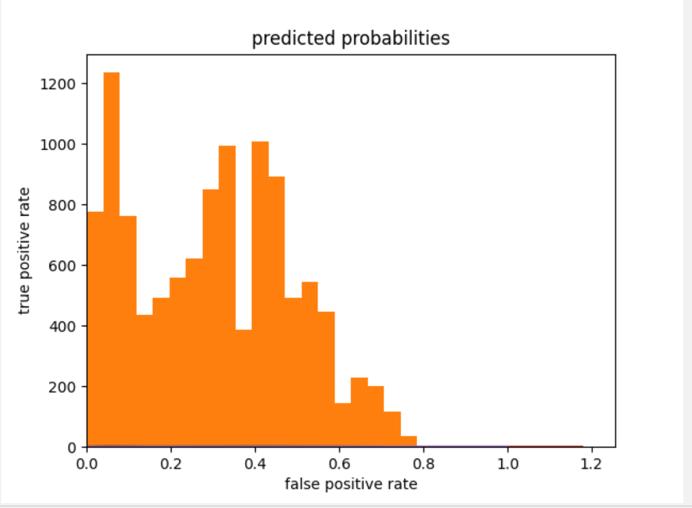

## Model 4 ##
### Using the python script provided, train a gradient boosting model using decision trees with the tensorflow estimator. Provide evaluative metrics including a measure of accuracy and AUC. Produce the predicted probabilities plot as well as the ROC curve for each wealth outcome and interpret these results. ###
Evaluation metrics:

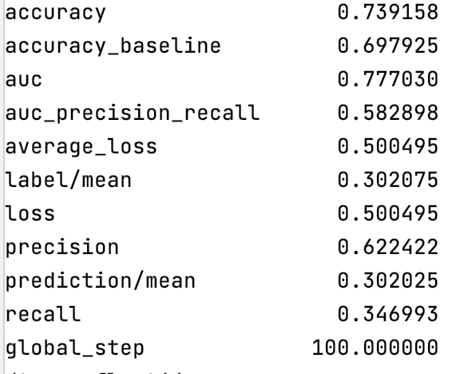

ROC:

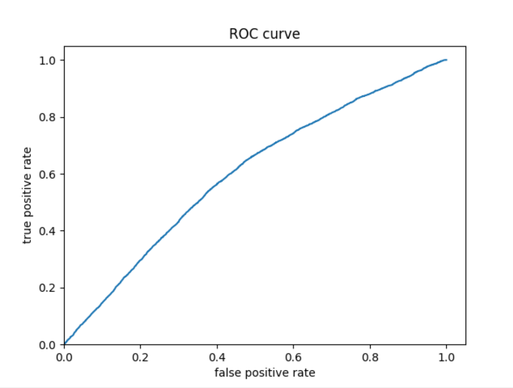

Predicted probability histogram:

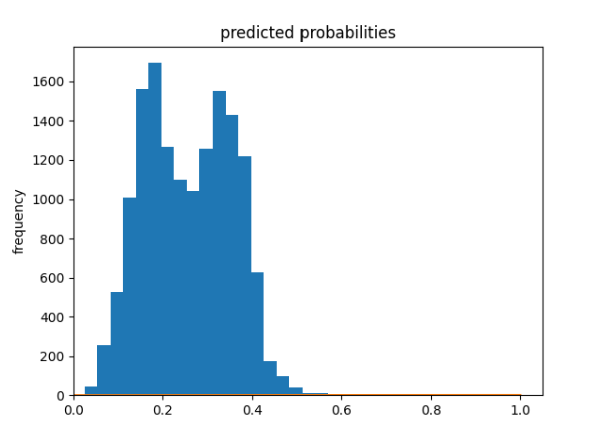

Model 4 seems to have a higher prediction accuracy than model 3 (accuracy = 0.74), and the values are much less underpredicted. 

## Compare all 4 models ##

Model 4 clearly produced the best results, with a prediction accuracy of 0.74.
The main descrepancy is that the model seems to be unable to distinguish low and middle income groups from the high income groups. This suggests a wide gap between the low & middle income groups and the high income group, and a small gap among the low & income groups. In other words, a small group of people in Tajikstan may be extremely rich, while the rest of the people are relatively low income. Even the middle class might not be significantly richer than the lower class. Considering the political and economic reality of Tajikstan, this might be a possibility. 
