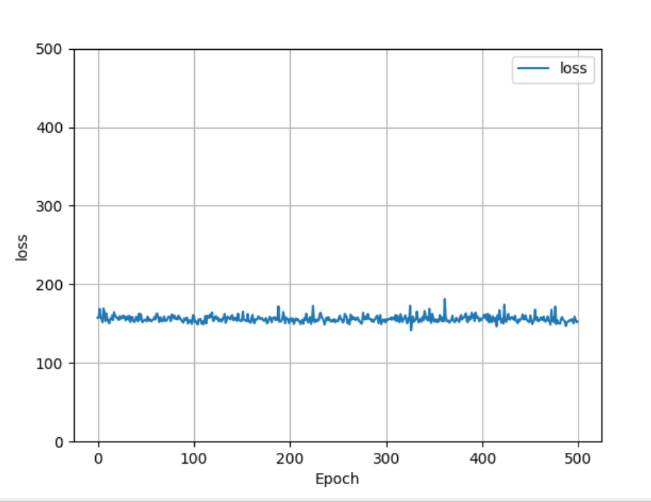
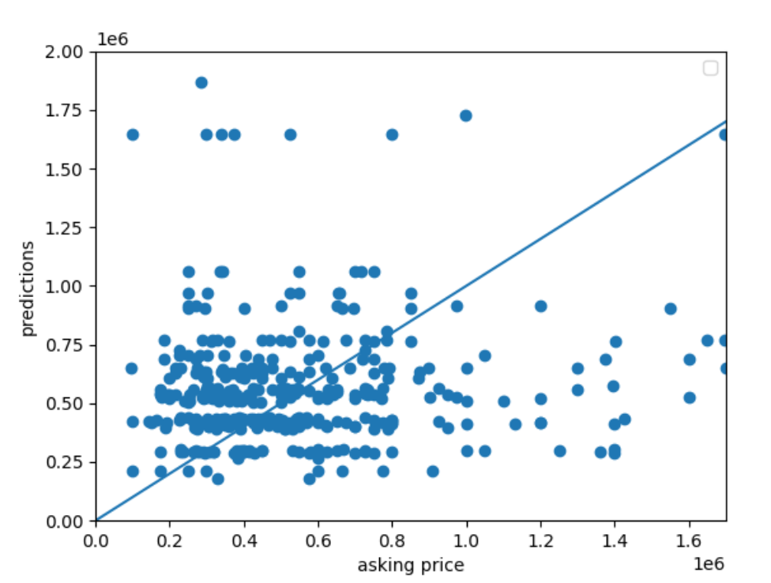
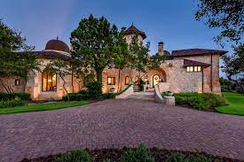
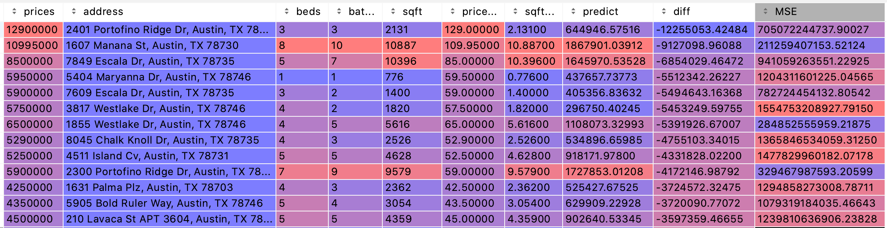
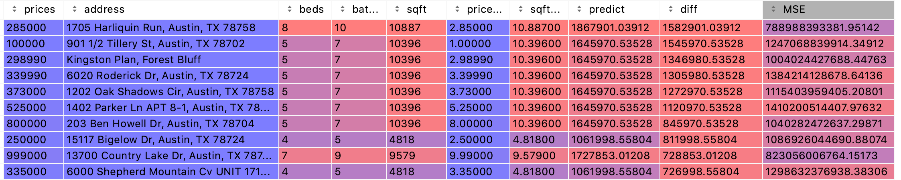

1. **A description of the housing data you scraped from zillow:**
- 400 homes from Austin, Texas were collected from the Zillow website. There were no missing entries in the initial dataset and therefore all the datapoints were retained. This table below includes the descriptive statistics of the dataset: 

| measure | price ($) | # of beds | # of baths | sqft |
|---------|-------|-----------|------------|------|
| mean    | 823865     | 3  |      3      |    2556  |
| std     |  1271322|    1.12   |     1.37       |    1774.36  |
| min     | 95000 |      1    |    1        |   401   |
| 25%     |  325000|     3 |       2     |  1624    |
| 50%     |482500       |  4     |  3          |  2161    |
| 75%     |749750       |    4   |   3         | 3054     |
| max     |12900000       |  8  |     10       |    10887  |

- It is unsurprising to see that more expensive houses have more beds and bathrooms, and are significantly larger than the less expensive houses. In fact, houses who rank at 75 percentile in price is almost twice as large as houses with prices ranked in 25% percentile. Across houses of different prices, the number of bedrooms and bathrooms only varied in a small amount. This may be explained by the common sense that houses do not need an excessive amount of bedrooms and bathrooms since we no longer live in Victorian castles. This also might mean that the number of bedrooms and bathrooms would not be good predictors for house price. On the other hand, since the sqft of the house is generally positively correlated with the price of the house, sqft may be a better predictor for price compared to the number of bedrooms and bathrooms.

**2. A description of your model architecture:**
- Data was scraped from the Zillow webpage and cleaned through taking off headings and extraneous strings with regular expressions. Some columns were reorganized and missing values were inspected. Columns that were necessary to analysis, including prices, beds, baths, and sqft, were exported to a separate csv for easier inspection and model training. In the beginning of the model training script, prices and sqft were standardized by being devided by 1000. The purpose of this is for faster model training (preventing large numbers and strenuous calculation) and also more convenient observation. 

- Then, a one-dense-layer neural network was constructed, and the model convolves through independent variables including the bedroom, bath, and sqft columns. The convolutions are then stacked, and the dependent variable, house prices, was predicted by the independent variables through the model.fit( ) function. The optimizer function used was sgd, and the loss function used was mean squared error. 500 training epochs were conducted. 

- Below is a plot of the training result. It is obvious that the loss was small across training episodes, which means that the model did not improve its prediction accuracy through the training. Maybe better indicators such as construction year and zip codes would improve the model's accuracy.

3. Model output analysis:
The MSE of the Top 10 most underestimation is 820079440201.5881. The MSE of the Top 10 most overestimation is 1044263606731.694. The MSE of the Top 10 most accurate observations is 612575903.9848686. The most accurate predictions are ranked 182-191, which is approximately 45-47 percentile. This reflects that the model overall underestimates slightly. 

This is the graph for prediction and the actual listing prices.

The MSE of the Top 10 most underestimation is 820079440201.5881. The MSE of the Top 10 most overestimation is 1044263606731.694. The MSE of the Top 10 most accurate observations is 612575903.9848686. The most accurate predictions are ranked 182-191, which is approximately 45-47 percentile. This reflects that the model overall underestimates.  

4. Worst deals
- The model gives the worst deal award to the house at 2401 Portofino Ridge Dr, Austin, TX 78735. This house has 3 beds and 3 baths, and has 2131 sqft. It has a astronomical price of 129,000,002,401, while the model predicted it to have a price of 644,946. The resulting difference between the listing and the predicted price is 12255053.42484. However, as shown below, this house is indeed a very fancy mansion. Therefore, maybe vanity value and the irresistible and evil human desire of showing high monetary power should be added into the model. 

Below is a table containing the 10 worst deals for house buyers. 

5. Best deals
- The model ranks the house at 1705 Harliquin Run, Austin, TX 78758 to be the best deal for buyers among all 400 houses. This house has 8 beds, 10 baths, and is 10887 sqft! The model predicted the price for this house to be 1,867,901, but in fact you can make this dream your own with only 285,000! The resulting difference between the listing and the predicted price is 1582901.03912. This is the true American dream, ladies and gentlemen. If you are a middle-aged parent with 6-7 noisy children, this house would indeed make life so much better for you. You can use all that extra money to buy a jet, have a pet crocodile, or endorse a rediculous republican politician (don't).

Below is a table containing the 10 best deals for house buyers. 

