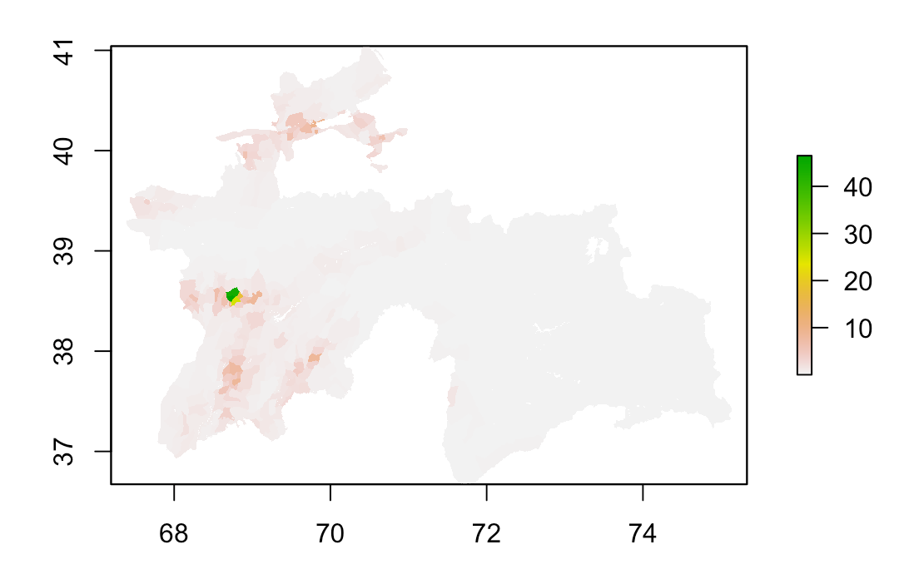

For this project, I am focusing on the Tajikistan. Tajikistan is the smallest country in Central Asia and is landlocked. It has a population of approximately 9 million and is less densely populated than the majority of countries in the world. (info from Wikipedia page of "Tajikistan)

I used two machine learning methods to predict population in Tajikistan: linear regression and random forest modeling. The accuracy of these models were assessed with Mean Absolute Error (MAE) and Mean Standard Error (MSE). Since Tajikistan has a small population, it is expected that population distribution will not be dense and collected.

### Linear Reg Model ###

Plot of population sums:

Plot of difference of sums between actual population and predicted model. The plot did not show severe over or underprediction.

A 3D difference of sums plot, as displayed below, can elucidate the details of prediction validity. 

The 3D plot shows over prediction near the capital Dushanbe, and scattered under-prediction in various provincial regions. Since Dushanbe is significantly more densely populated than all the other regions in Tajikistan, it is expected that larger errors in prediction would occur there.

MAE and MSE were used to assess the validity of the model. 

MSE plot (MSE = 107396800, by cellstats):

A 3D plot from the same MSE calculation:

MAE plot (MAE = 6344468, by cell stats):

### Random Forest Model ###

Data containg 12 geospatial variables was splitted into training and testing sets for random forest prediction of population distribution. the plot below compares the weight of each variable in the model prediction：

Night time lights is the most important predictor.

Plot of population sums:

Plot of difference of sums between actual population and RF model:

MSE plot：

MAE plot: 

### Model comparison ###

Based on the 2D difference of sums plots, these two models seem to not differ much in their prediction accuracy. However, the 3D difference of sums plots showed that

When looking at the MSE and MAE values, the ___ model showed larger error compared to _____. 

