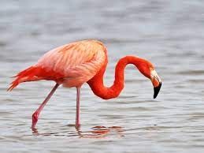
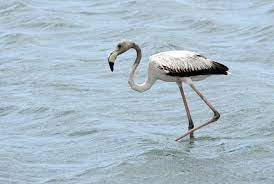

### Research topic ###

Due to human activity, many species of birds are now endangered and even facing extinction. Climate change is affecting the longevity and health of seabirds such as albatrosses and deforestation destroys the habitats of wood-dwelling birds such as the mangrove hummingbirds. Flamingos are also a group of birds that are negatively influenced by human activity, especially by fishing and water pollution in sea-facing areas. Many conservation organizations now have flamingos as their targeted protection animal and strive to provide injured flamingos or orphaned fledglings with medical care and housing. But traditional rescue work done by human searching can be quite time consuming and ineffective, and flamingos who are in need of help might not be identified until it is too late.

Machine learning algorithms designed to identify flamingos can be used in conjunction with searching drone technology, thus creating a wandering reconnoitering device to locate flamingo flocks in the area as well as to pinpoint flamingos that may be in danger --- indicators for danger may include being alone/separated from the flock, lack of movement, abnormal body positions, or presence of scars and wounds.  This project aims to train a machine learning model that can separate and identify flamingos against a variety of other birds, including birds that resemble flamingos in some aspects (such as roseate spoonbills). Since adult and juvenile flamingos look very different from each other, future work should also aim to train models to identify juvenile flamingos.

Moreover, contrary to popular belief, not all flamingos have pink feathers. If a flamingo in danger is not acquiring proper food that has enough carotene, they may turn pale pink or even white. It is just as important to identify these non-pink flamingos, because they may be more likely to be in danger. This model be test on its ability to identify a non-pink flamingo, although its training data only contains pink flamingos. 

A pink flamingo             |  A white flamingo, who also doesn't look very healthy
:-------------------------:|:-------------------------:
  |  

### Data description ###

I'm using a bird dataset from Kaggle, which contains 36609 images of 256 species of birds. The pictures are separated into training, testing, and validation folders. From the dataset, there are 105 flamingo photos in the training folder, 5 in the testing folder, and 5 in the validation folder. ALl images have been labelled with respective bird names (e.g. "ALBATROSS", "FLAMINGO"). 

### Model ###

I am using a convolutionary neural network to train the model to recognize different kinds of birds, and then I will test the model's ability to recognize flamingos as well as to tell apart between flamingos and roseate spoonbills. I will also upload several photos of my fluffy toy flamingo, Frederick, into the testing dataset, and see if the model will classify frederick as a flamingo based on the training it received. 

### References ###
https://www.fs.usda.gov/ccrc/topics/effects-climate-change-terrestrial-birds-north-america#:~:text=Research%20on%20birds%20has%20shown,use%20more%20energy%20for%20thermoregulation.
